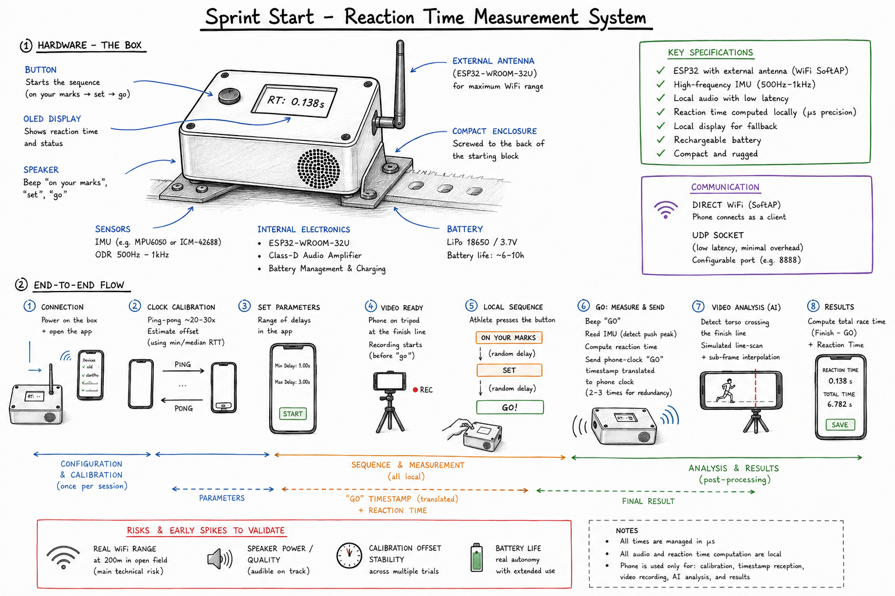

# 🏁 Reaction-Time System

**A low-cost, portable reaction-time and photo-finish system for track & field, built around a single microcontroller.**

> On 4 August 2024, Noah Lyles won the Olympic 100 m final in Paris by **five thousandths of a second** (0.005 s) over Kishane Thompson — a margin smaller than a single frame of standard video. Reaction time is one of the few things an athlete can deliberately train, yet the instruments precise enough to measure it are reserved for elite competitions and cost hundreds of thousands of krona. This project closes that gap.

---

## 🖼️ System at a glance



*The start box runs the whole start sequence and computes reaction time locally in microseconds, then sends the result over a Zigbee (XBee) link to the finish box. A phone at the finish line connects to the finish box over Bluetooth to display it. (The diagram predates the Zigbee/XBee revision and is being redrawn.)*

---

> 🧭 **Current hardware plan:** both boxes are built on a **Seeed XIAO nRF52840 Sense** (onboard 6-axis LSM6DS3 IMU, BLE) paired with a **Digi XBee** radio for the start ↔ finish link over **Zigbee**. A phone connects to the **finish** box over BLE to show the result. This replaces the earlier direct-Wi-Fi direction (**ESP32-WROOM-32U** / **Arduino Nano 33 IoT** / **M5Stack**), which assumed a single device talking straight to the phone.

---

## 📖 Overview

This repository contains the design and implementation of a **two-box system**:

1. 🔌 **Start box** — a small, battery-powered unit at the blocks that plays a randomized "on your marks – set – go" sequence, detects the athlete's push-off with an IMU, and computes reaction time locally with microsecond-level precision. It sends the result over a Zigbee (XBee) radio link to the finish box.
2. 🏁 **Finish box** — a unit at the finish line that receives the reaction time over Zigbee and relays it to a phone over Bluetooth for display. How the finish box registers the finish itself is still to be decided.

A later phase adds a **smartphone-camera photo-finish** layer — computer-vision torso-crossing detection with sub-frame interpolation — to reconstruct finish order and total race time for multi-lane races, with no extra dedicated hardware.

The goal isn't to replace certified competition timing systems, but to bring a meaningful fraction of their precision — enough to be genuinely useful for training, testing, and local competitions — down to a price point and portability that a club or an individual athlete can actually afford. 💪

Full technical write-up, design-alternative comparisons, cost analysis and business model: see [`report/main.tex`](./report/main.tex) (or the compiled PDF).

---

## 👥 Team

**KTH Royal Institute of Technology — Technology and Health Project Course, Group 1**

- Arianna Bartocci
- Duarte Chambel
- Lorenzo Galli
- Loke Enlund Östangård
- Ninad Purekar

---

## 🏗️ System Architecture

```
┌────────────────────────┐                     ┌────────────────────────┐                   ┌─────────────────────┐
│        Start box        │   Zigbee (XBee)    │        Finish box        │       BLE        │   Phone (Flutter)    │
│   XIAO nRF52840 Sense   │ ─────────────────▶ │   XIAO nRF52840 Sense   │ ──────────────▶ │                      │
│   + XBee radio          │   reaction-time     │   + XBee radio          │  reaction time  │  • Shows reaction    │
│                         │   payload           │                         │                 │    time              │
│  • IMU push-off detect  │                     │  • Receives result      │                 │  • Photo-finish      │
│  • "Go" cue (µs clock)  │                     │  • Finish trigger: TBD  │                 │    video (later)     │
│  • Onboard speaker      │                     │  • Relays to phone      │                 │                      │
└────────────────────────┘                     └────────────────────────┘                   └─────────────────────┘
```

Reaction time (the interval from the "go" cue to the detected push-off) is measured and computed entirely on the start box, on one MCU clock. The Zigbee link only carries the finished number; the finish box adds the finish event and forwards both to the phone.

### Key design decisions ⚖️

| Component | Chosen approach | Why |
|---|---|---|
| Push-off detection | **IMU** (accelerometer) on the start-box body | Cheap, no block modification needed, easy retrofit — vs. a force/pressure sensor behind the pedal (more accurate, but invasive) |
| Start sequence | **Onboard speaker**, locally generated | Zero sync uncertainty between "go" cue and measurement clock, works without a human starter — vs. microphone listening to an external starter |
| Reaction-time clock | **Computed on the start box** in `micros()` | "Go" cue and push-off are timed on one MCU, so there is no cross-device clock sync in the measurement path |
| Start ↔ finish link | **Zigbee via XBee modules** | Purpose-built for long-range, low-power point-to-point telemetry; the link only ferries a small result payload, not a stream |
| Finish ↔ phone link | **Bluetooth LE** | Phone sits at the finish line next to the finish box; BLE covers that short hop and the Flutter app already speaks it (`flutter_blue_plus`) |

The earlier direct-Wi-Fi (SoftAP + UDP) start-device-to-phone link is dropped: it needed ~200 m of reliable Wi-Fi range, previously the single largest technical risk. XBee/Zigbee range over the track is the replacement risk to validate — see [Open Risks](#-open-risks--things-to-validate) below.

---

## 📊 Key Performance Indicators

- **Reaction time** — µs-precision, from "go" cue to detected push-off, computed on the start box
- **Ground contact / flight time** *(future extension)*
- **Finish-line crossing order & total race time** — via the photo-finish extension
- **Zigbee link reliability** — delivery rate and latency of the start → finish result payload across the track

---

## 🧰 Hardware

| Component | Box | Purpose |
|---|---|---|
| Seeed XIAO nRF52840 Sense | both | Main MCU — onboard LSM6DS3 IMU + BLE, small and Arduino-friendly |
| Digi XBee module (+ carrier / adapter) | both | Zigbee radio for the start ↔ finish link |
| Class-D amplifier + speaker | start | Start-sequence playback |
| Push button | start | Manual trigger / arm |
| 0.96" OLED display | both | Local status / reaction-time readout |
| LiPo battery + charge circuit | both | ~6–10 h continuous use |
| Finish-detection sensor | finish | **TBD** — the finish-trigger mechanism is not yet decided |

The onboard **LSM6DS3** IMU covers push-off detection, so no external IMU is wired.

> 🧪 **Prototyping** is on the Seeed XIAO nRF52840 Sense + XBee for both boxes, validating the Zigbee link, IMU push-off detection, and firmware basics before committing the enclosure and final BOM.

---

## 💻 Software Stack

- **Firmware:** Arduino (C/C++), `ArduinoBLE`, `Wire.h` (I2C), the vendored Seeed LSM6DS3 library, and the XBee over a hardware UART (transparent or API mode)
- **Companion app:** Flutter (Dart) — `flutter_blue_plus` (BLE)
- **Photo-finish AI pipeline:** computer-vision torso-crossing detection + sub-frame interpolation *(planned, later phase)*

---

## 📂 Repository Structure

```
Reaction-Time-System/
├── Arduino/               # Arduino sketches (.ino), one folder per sketch
│   ├── BLEtest/           # current BLE + IMU streaming sketch
│   ├── HighFrequencySampleRate/  # high-rate serial capture sketch
│   ├── I2C_Scanner/       # I2C bus debug sketch
│   ├── Reaction_HardwareTest/    # display / wiring bring-up sketch
│   ├── Xbee_Passthrough/  # USB<->Serial1 bridge: makes the XIAO XCTU's serial adapter
│   ├── Xbee_RangeTest/    # start<->finish link range & reliability test (API mode)
│   └── libraries/         # vendored board libraries (Seeed LSM6DS3)
├── prostart/              # Flutter companion app
├── playground_IMU/        # IMU evaluation notebook + findings
├── playground_xbee/       # XBee range-test method + findings
├── data/                  # IMU + XBee capture CSVs
├── tools/                 # host-side capture / export / analysis tools
├── docs/                  # diagrams and figures
├── HANDOFF.md             # working notes
└── README.md
```

---

## 🚀 Getting Started

### Firmware
1. Install the [Arduino IDE](https://www.arduino.cc/en/software) (or `arduino-cli`)
2. Add the Seeed nRF52 board-package URL under **Preferences → Additional Board Manager URLs** and install it via **Boards Manager** — board: *Seeed XIAO nRF52840 Sense* (mbed core; `ArduinoBLE` does not link on the non-mbed core)
3. Open a sketch from `Arduino/`, select the board & port, and **Upload**

### Radios
2 × XBee / XBee-PRO **S2C** (`XB24CZ7PIT-004`, 2.4 GHz Zigbee, PCB antenna). In Digi **XCTU**, flash the **XB24C (Z7) — Zigbee** firmware (*not* XBee3): one module as *Coordinator API*, the other as *Router API*. Both need the same `ID` (PAN ID) and `AP=1`, and `BD=7` (115200) to match the firmware's `XBEE_BAUD` — the 9600 default is too slow for the range test, where one ping costs four UART transactions. Set `BD=7` on **both** modules first, *then* change `XBEE_BAUD` and reflash; the other order leaves a 115200 board talking to a 9600 module. XBee is 3.3 V — wired straight to the XIAO (`DOUT→D7`, `DIN→D6`), no level shifter.

Our XBee adapter (Parallax 32403) is a passive breakout with no USB chip, so XCTU cannot see the module directly: flash `Arduino/Xbee_Passthrough/` to a XIAO to use it as the USB-to-serial adapter, configure one module at a time, then reflash. Production firmware uses the XBee in transparent mode; `Arduino/Xbee_RangeTest/` uses API mode to collect delivery-status and RSSI for the range test — see [`playground_xbee/`](./playground_xbee/).

### App
1. Install [Flutter](https://docs.flutter.dev/get-started/install)
2. `cd prostart && flutter pub get`
3. `flutter run`

---

## ⚠️ Open Risks / Things to Validate

Flagged early as the main items to test experimentally before committing to the final design:

- 📡 **Zigbee/XBee range** at up to ~200 m along a track, plus delivery reliability of the start → finish payload — the single largest architectural risk
- 🏁 **Finish-detection mechanism** — not yet chosen; it drives the finish-box BOM and firmware
- 🔊 **Speaker audibility** on an active, noisy track, at range
- 🔋 **Battery life** under real, extended use, per box
- 📶 **BLE range finish-box ↔ phone**, and 2.4 GHz coexistence with the XBee sharing the enclosure

---

## 🗺️ Roadmap

- [x] Validate dev board toolchain (Arduino + board support)
- [x] Confirm onboard IMU; characterise push-off signal vs. noise floor
- [ ] Bring up the XBee/Zigbee link between two XIAO boards; measure range and delivery rate on a track — test tooling in `Arduino/Xbee_RangeTest/` + `tools/xbee_range_*.py`, method in `playground_xbee/`
- [ ] Decide how the finish box registers a finish
- [ ] Start-box firmware: push-off detection, "go" signal, on-device display
- [ ] Finish-box firmware: receive result over Zigbee, relay to phone over BLE
- [ ] Flutter app: BLE connection to the finish box, reaction-time display
- [ ] Finalize component list & assemble breadboard prototype of both boxes
- [ ] End-to-end validation against photocell timing gates (Bosön)
- [ ] **Later phase:** photo-finish video capture, torso-crossing detection, sub-frame interpolation, time alignment

---

## 📚 References

- World Athletics, *Competition and Technical Rules* — reaction-time threshold for false starts (100 ms)
- Pain, M. T., & Hibbs, A. (2007). Sprint starts and the minimum auditory reaction time. *Journal of Sports Sciences*, 25(1), 79–86.
- Brosnan, K. C., Hayes, K., & Harrison, A. J. (2017). Effects of false-start disqualification rules on response-times of sprinters and possible sex differences.
- Official results and photo-finish image, Men's 100 m Final, Paris 2024 Olympic Games (Omega Timing / World Athletics)

---

## 📄 License

