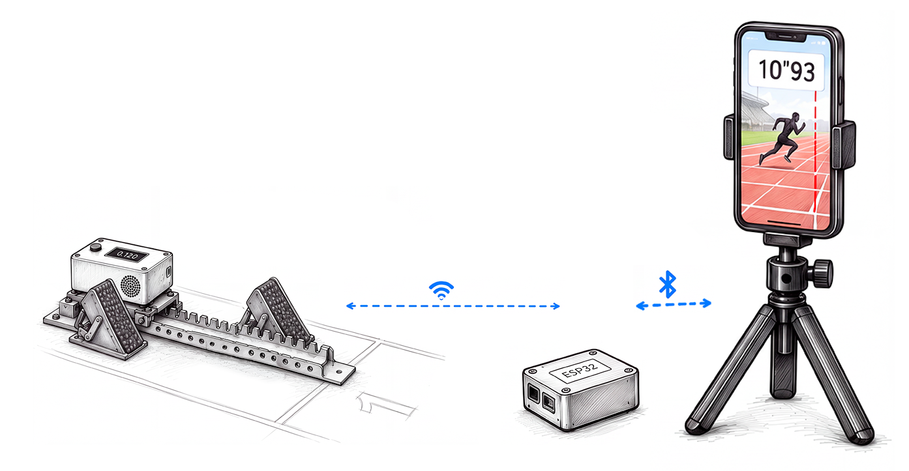

# 🏁 Reaction-Time System

**A low-cost, portable reaction-time and photo-finish system for track & field: a sensor unit on the starting block, a relay beside the finish line, and a phone app.**

> On 4 August 2024, Noah Lyles won the Olympic 100 m final in Paris by **five thousandths of a second** (0.005 s) over Kishane Thompson — a margin smaller than a single frame of standard video. Reaction time is one of the few things an athlete can deliberately train, yet the instruments precise enough to measure it are reserved for elite competitions and cost hundreds of thousands of krona. This project closes that gap.

---

## 🖼️ System at a glance



*The start unit times the reaction locally, in microseconds, on its own clock. The radio chain only has to deliver the result and the start instant to the phone, which films the finish.*

---

## 📖 Overview

This repository contains the design and implementation of a **two-part system**:

1. 🔌 **Starting device** — a small, battery-powered unit at the blocks that plays a randomized "on your marks – set – go" sequence, detects the athlete's push-off with an onboard accelerometer, and computes reaction time locally with microsecond-level precision.
2. 📱 **Photo-finish companion app** — uses the phone's own camera at the finish line to reconstruct finish order and total race time. The free tier relies on the user manually marking each athlete's torso crossing the line; the premium tier automates that with computer vision and sub-frame interpolation.

The goal isn't to replace certified competition timing systems, but to bring a meaningful fraction of their precision — enough to be genuinely useful for training, testing, and local competitions — down to a price point and portability that a club or an individual athlete can actually afford. 💪

Costs, pricing, and a rough revenue projection are laid out in [Business Plan](#-business-plan) below. The technical write-up for the course is the half-time paper, in [`Half Time Paper/`](./Half%20Time%20Paper/).

---

## 👥 Team

**KTH Royal Institute of Technology — Technology and Health Project Course, Group 1**

- Arianna Bartocci
- Duarte Chambel
- Lorenzo Galli
- Loke Enlund Östangård
- Ninad Purekar

---

## ⚙️ How the System Works

```
XIAO nRF52840 Sense ──wire── ESP32 #1  ──ESP-NOW long range──  ESP32 #2 ──BLE──  Phone
   (start block)            (start block)        ~100 m           (finish line)    (prostart app)
```

- **Start unit: XIAO nRF52840 Sense + ESP32 #1.** The XIAO sits on the block. It plays the "on your marks – set – go" sequence on its buzzer, detects the push-off with its onboard IMU, and computes the reaction time **locally**, on the same clock that generated the "go". No radio latency downstream ever touches the measurement. The ESP32 next to it is the XIAO's radio: the XIAO raises a pin at the start instant (t0), the ESP32 timestamps that edge in a hardware interrupt, and it sends the result on.
- **Start ↔ finish: ESP-NOW long range.** Espressif's long-range mode (`WIFI_PROTOCOL_LR`) between two ESP32s. The gain comes from coding, i.e. receive sensitivity, not from transmit power, so it stays within the EU limits. There is no access point, no association and no TCP, just two bare-metal boards.
- **ESP32 #2: the finish-line relay.** It sits near the phone and has no size or placement constraints, so this is where an external antenna and height go.
- **Finish ↔ phone: BLE.** Only over a few metres. The phone never needs to be near the start.
- **Phone: the `prostart/` Flutter app.** It shows the reaction time, logs it, and films the finish. The start instant t0 from the block is the zero of the photofinish time.

### Why this chain, and not a single link

Each choice here was measured, not assumed (details in `HANDOFF.md`):

1. **BLE alone reaches ~25 m.** Sprint start to finish is 100 m.
2. **One ESP32 on Wi-Fi straight to the phone reaches 60-70 m.** It was measured in the field with `Arduino/WifiFieldTest`: clean to ~50 m and dead at 70 m (-91 dBm), 3-4 dB short of 100 m. On top of that, the phone would have to join a device network before every session.
3. **ESP-NOW long range covers the long hop between two dedicated boards, and BLE covers the short one to the phone.** The hard hop, XIAO to radio, is a wire, and the fragile one, radio to phone, is never more than a few metres long.

**Latency does not matter, arrival does.** The reaction time is already final when it leaves the block, and t0 carries its own timestamp. What the link has to guarantee is that the message arrives, and that the clocks can be related. The error budget for the photofinish is set by the phone camera's frame rate (a 30 fps frame is ~33 ms), not by the radios (2.5-4 ms of sync jitter measured).

### Key design decisions ⚖️

| Component | Chosen approach | Why |
|---|---|---|
| Push-off detection | **IMU** (accelerometer) on the device body | Cheap, no block modification, easy retrofit. A force/pressure sensor behind the pedal would be more accurate, but invasive |
| Start sequence | **Onboard buzzer**, generated locally | Zero sync uncertainty between the "go" and the measurement clock, and no human starter needed |
| Start unit radio | **ESP32 wired to the XIAO** | Keeps the timing-critical firmware on the XIAO untouched. The t0 handover is a pin edge, sub-µs |
| Start ↔ finish link | **ESP-NOW long range** | Range the single Wi-Fi link could not reach, without raising transmit power |
| Finish ↔ phone link | **BLE** | Universal, pair once, and only a few metres long |

---

## 📊 Key Performance Indicators

- **Reaction time** — µs-precision, from "go" cue to detected push-off
- **Ground contact / flight time** *(future extension)*
- **Finish-line crossing order & total race time** — via the photo-finish extension
- **Clock synchronization stability** across trials, over ESP-NOW (start ↔ finish) and over BLE (finish ↔ phone)

---

## 🧰 Hardware

### Start unit

| Component | Purpose |
|---|---|
| Seeed XIAO nRF52840 Sense | MCU + onboard 6-axis IMU (LSM6DS3): start sequence, push-off detection, reaction time |
| ESP32-C3 (SuperMini) | The XIAO's radio: ESP-NOW long range to the finish |
| Push button | Manual trigger |
| Buzzer | Start-sequence playback, driven at its 4 kHz resonance |
| LiPo battery + charge circuit | Powers both boards |

### Finish relay

| Component | Purpose |
|---|---|
| ESP32 | ESP-NOW long range ↔ BLE bridge to the phone |
| External antenna (optional) | Range margin, on the side with room for it |
| Battery | Its own cell, so it does not drain the phone while it films |

---

## 💻 Software Stack

- **Firmware (implemented):** Arduino IDE (C/C++) on the XIAO, `Seeeduino:mbed` core (the `nrf52` core silently degrades `micros()` to ~1 ms), and the vendored Seeed `LSM6DS3` library. `Arduino/AlgorithmRealTime/` runs the start sequence and the on-device detector. `Arduino/WifiFieldTest/` is the ESP32-C3 sketch the range was measured with.
- **Firmware (not yet implemented):** the XIAO → ESP32 pin handover, the ESP-NOW long-range link, and the relay's BLE bridge. The first thing to test is whether ESP32 #2 can run long range and a link to the phone at the same time on its single 2.4 GHz radio. Tracked on the [backlog](https://github.com/users/lorenzogalli-dev/projects/4).
- **App:** Flutter (Dart), in `prostart/`. Today it is the UI with mock data. The BLE layer (`flutter_blue_plus`) will be ported from the previous app in `old_flutter_app/prostart/`.
- **Capture/analysis tooling:** Python (`capture.py`, `start_detector.py`, `sweep_threshold.py`). See [BUILD.md](./BUILD.md) for exact versions and setup.
- **Photo-finish AI pipeline:** computer-vision torso-crossing detection + sub-frame interpolation *(premium tier, planned)*.

---

## 💰 Business Plan

*Illustrative figures for this course project's business case — not a funded venture. All amounts in SEK, with a rough USD equivalent at ~10.5 SEK/USD for context.*

### Cost side

**Hardware (bill of materials, per full kit = 1 start unit + 1 finish relay):**

| Item | Qty | Unit cost | Line cost |
|---|---|---|---|
| Seeed XIAO nRF52840 Sense | 1 | 180 SEK (~$17) | 180 SEK |
| ESP32-C3 | 2 | 40 SEK (~$4) | 80 SEK |
| Enclosures, button, buzzer, antenna, misc. wiring | 1 set | 200 SEK | 200 SEK |
| LiPo battery + charge circuit | 2 | 70 SEK | 140 SEK |
| Assembly & QA overhead | — | 150 SEK | 150 SEK |
| **Total COGS per kit** | | | **~750 SEK (~$71)** |

**Development ("us as programmers"):** built by a 5-person team over one KTH course term — sweat equity, not a cash cost at this stage. If this moved past the course into an actual venture, a realistic estimate to take the current prototype to a manufacturable v1 (firmware hardening, ESP-NOW bring-up, enclosure design, app polish, compliance testing) is **~1,200,000 SEK (~$114,000)** over 6 months, mostly salaries for a small team.

### Revenue side

**Hardware price:** 1,990 SEK (~$190) per kit, retail — well under the "hundreds of thousands of kronor" professional systems cost from the pitch at the top of this README. Gross margin per kit: ~1,240 SEK (~62%).

**App — freemium:**

| Tier | Price | What you get |
|---|---|---|
| **Free** | 0 SEK | Reaction time display + manual photo-finish (tap to mark torso crossing). Shoe-brand banner ads. |
| **Premium — monthly** | 79 SEK/mo (~$7.5) | + Multi-athlete logging, AI-automated photo-finish, no ads |
| **Premium — 6 months** | 399 SEK (~66 SEK/mo) | Same as monthly, discounted for committing |
| **Premium — annual** | 699 SEK (~58 SEK/mo) | Same as monthly, best per-month rate |
| **Club / Coach plan** | 2,499 SEK/year | Everything in Premium, up to 25 athlete profiles, exportable session history, priority support |

**Advertising:** free-tier users see sponsored shoe-brand placements in the app (a banner plus a post-session "your shoes" card) — a secondary revenue line that subsidizes the free tier without paywalling the core reaction-time feature.

### Market size & a rough projection

*Assumptions, not cited research — a ballpark to size the opportunity.*

- **TAM:** ~50,000,000 people worldwide train or compete in track & field at school, club, or amateur level.
- **Target Year-3 penetration:** a deliberately modest 0.02% → **10,000 hardware kits** sold and **~15,000** active app users in total (some app-only, e.g. on a club-owned kit, or using the free tier without ever buying hardware).
- **Assume** 20% of active app users convert to some Premium tier, at a blended average of ~600 SEK/user/year across the monthly/6-month/annual mix.

| Line | Volume | Unit revenue | Total |
|---|---|---|---|
| Hardware kits | 10,000 | 1,990 SEK | 19,900,000 SEK |
| Premium subscriptions | 3,000 users | ~600 SEK/yr | 1,800,000 SEK |
| Ad revenue (free tier) | 12,000 users | ~20 SEK/yr | 240,000 SEK |
| **Total Year-3 revenue** | | | **~21,940,000 SEK (~$2.1M)** |
| Hardware COGS | 10,000 | 750 SEK | 7,500,000 SEK |
| **Gross profit (before opex)** | | | **~14,440,000 SEK (~$1.4M)** |

This is a back-of-the-envelope model to size the opportunity, not a forecast — customer-acquisition cost, support, warranty returns, and the radio-link risks above all sit outside it.

---

## 📂 Repository Structure

```
Reaction-Time-System/
├── Arduino/                     # Arduino sketches (.ino), one folder per sketch
│   ├── AlgorithmRealTime/       # current firmware + its Python bench tooling
│   │   ├── AlgorithmRealTime.ino   # start sequence, capture, on-device detector
│   │   ├── StartDetector.h         # causal STA/LTA stage
│   │   ├── AicPicker.h             # AIC onset refinement + the verdict rule
│   │   └── Python_Tools/           # bench tooling, never runs on the board
│   │       ├── capture.py          # writes the board's dumps to CSV; no logic
│   │       ├── start_detector.py   # the same algorithm offline (GUI/CLI): tuning
│   │       │                       #   and the reference the C++ is checked against
│   │       └── verify_rate.py      # pass/fail check on rate, clock and integrity
│   ├── WifiFieldTest/           # ESP32-C3: the field range test of the Wi-Fi t0 link
│   ├── BuzzerSweep/             # diagnostic: finds the buzzer's resonance
│   ├── ClockCheck/              # diagnostic: measures real micros() resolution
│   ├── SerialEchoTest/          # minimal hardware/cable sanity check
│   ├── I2C_Scanner/             # I2C bus debug sketch
│   └── libraries/               # vendored board libraries (Seeed LSM6DS3)
├── prostart/                    # Flutter app (current; UI with mock data for now)
├── old_flutter_app/
│   └── prostart/                # previous app: BLE + live accelerometer, no longer developed
├── Data/                        # recorded CSV captures and their plots
├── Docs/                        # architecture image, diagrams, figures
├── Half Time Paper/             # the course's half-time paper (PDF)
├── RUN.md                       # what each file is and the command to run it
├── INFO.md                      # how the detection algorithm works, and why
├── BUILD.md                     # exact versions and how to run every component
├── HANDOFF.md                   # working notes for an agent picking this up
└── README.md
```

---

## 🚀 Getting Started

### Firmware
1. Install [Arduino IDE](https://www.arduino.cc/en/software)
2. Add your board's package URL under **Preferences → Additional Board Manager URLs**
3. Install the board package via **Tools → Board → Boards Manager**
4. Open a sketch from `Arduino/`, select the correct board & port, and **Upload**

### App
1. Install [Flutter](https://docs.flutter.dev/get-started/install)
2. `cd prostart && flutter pub get`
3. `flutter run`

For exact tool/library versions and the full step-by-step for both firmware and the Python capture tooling, see **[BUILD.md](./BUILD.md)**.

---

## ⚠️ Open Risks / Things to Validate

What we're actually seeing right now, not a wishlist:

- 📡 **One ESP32 radio, two links.** ESP32 #2 has to talk ESP-NOW long range to the block and BLE to the phone on the same 2.4 GHz radio. Not tested yet, and it decides whether this architecture works as drawn. It is the next thing to test, one afternoon on a single board.
- 📏 **Range.** Direct Wi-Fi measured 60-70 m against the 100 m needed (possibly 150 m). Long range has not been measured on our hardware yet, and every number so far was taken on empty air, not in a stadium full of 2.4 GHz traffic.
- ⏱️ **The phone camera is the timing bottleneck** for the photofinish: frame rate, rolling shutter and the frame-timestamp offset, none of them measured yet on the phones that will be used.
- 🔊 **Buzzer acoustic latency (5-20 ms), still unmeasured.** It enters every reaction time, and so does the buzzer's audibility on a noisy track.
- 🔋 **Battery life** under real, extended use, for both units.
- 🛠️ **Firmware reliability.** An earlier firmware combining BLE, a hardware FIFO, and a software PLL on the XIAO hung or crash-looped unpredictably on two boards. It was replaced by the deliberately minimal firmware in `Arduino/AlgorithmRealTime/`, now verified on real hardware. Moving the radio to a separate ESP32 is also what keeps the XIAO that simple. Full write-up in `HANDOFF.md`.

---

## 🗺️ Roadmap

Day-to-day tasks and priorities live on the project backlog, not here:

👉 **[GitHub Projects backlog](https://github.com/users/lorenzogalli-dev/projects/4)**

---

## 🔮 Future: how an athlete actually starts a race

The end-to-end experience we're building toward:

1. The coach or athlete opens the app and pairs with the finish relay once over BLE. The relay is already paired with the start unit over ESP-NOW, so this is a one-time setup, not a per-session ritual.
2. The athlete gets into the blocks. Someone taps **Start** in the app, or presses the physical button on the start unit directly — no phone needed at the blocks.
3. The start unit plays "on your marks… set…" with a randomized delay, then "go" — and the reaction-time clock starts at the exact instant the sound leaves the speaker.
4. The IMU detects the push-off. The XIAO computes the reaction time locally, and its ESP32 sends it, with the start instant, over ESP-NOW long range to the finish relay, which passes it to the phone over BLE.
5. The phone shows the reaction time immediately, and — if the camera was recording — lets the user tag the torso crossing for a total time, automatically on Premium.
6. Everything is logged to that athlete's profile: viewable individually on Free, or across a whole squad on a Coach plan.

No Wi-Fi network to join, no manual clock-calibration step for the user — just press start and run.

---

## 📚 References

- World Athletics, *Competition and Technical Rules* — reaction-time threshold for false starts (100 ms)
- Pain, M. T., & Hibbs, A. (2007). Sprint starts and the minimum auditory reaction time. *Journal of Sports Sciences*, 25(1), 79–86.
- Brosnan, K. C., Hayes, K., & Harrison, A. J. (2017). Effects of false-start disqualification rules on response-times of sprinters and possible sex differences.
- Official results and photo-finish image, Men's 100 m Final, Paris 2024 Olympic Games (Omega Timing / World Athletics)

---

## 📄 License

